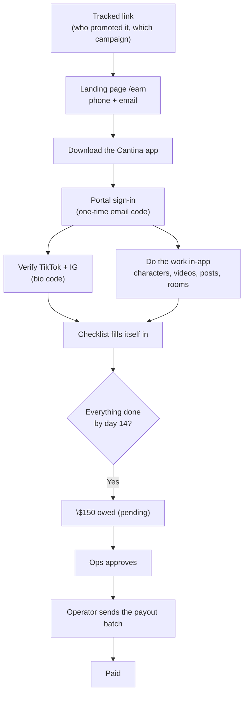

Before the three-stage program, there was the 14-day sprint: cohorts 1 through 5, June and July 2026. Creators from that era are still in the roster with their original requirement sets, and understanding how their program worked makes their records make sense.

## The deal

A creator had **14 days, starting the moment they joined the sprint room**, to complete a set of requirements. Finish everything and a flat **\$150** landed. All or nothing, with the portal tracking every requirement live so nobody had to guess where they stood.

## The journey

Every creator arrived through a tracked link, so each signup tied back to the exact affiliate, source, and campaign that brought them in, all the way through to whether they finished and got paid. That attribution machinery is still how cohort ad-tests are read today.

## The requirements

The cohort 1 checklist, with live counts in the portal:

1. Join the community room (starts the 14-day clock)
2. Submit their Cantina username
3. Verify TikTok ownership (bio code)
4. Verify Instagram ownership (bio code)
5. Create 4 characters in the app
6. Make 5 videos per character
7. Publish 20 posts across TikTok and Instagram
8. Attend 4 live rooms

Cohort 2 (v2) simplified: the character work became one character plus three winning concepts from the concept tester, and the post floor became 10. Cohort 5 (v3) dropped the username step. Each era's roster rows still display their own requirement set on the dashboard.

## What creators never had to do

**Upload proof.** The founding design decision, still true today: verification comes from systems, never screenshots. Social account ownership by a code in the bio, posts by automatic tracking from verified handles, in-app activity from Cantina's daily data passback. The creator's only job was doing the work.

## How the money moved

The payout pipeline this era built is the same one running now: a passing verdict queued a **pending** \$150 row, a reviewer **approved** it in the dashboard, an operator ran the **send** (deliberately behind operator access, a command rather than a button, so nobody could move real money with a stray click), and the provider settled it to **paid** with automatic status updates. The first real payout went end to end in late May 2026, and everything the program pays today, from the \$40 setup bonus to per-post pay, rides the same rail.

## What the sprint taught us

- **The two-surface split was the hard part.** Creators lived in the app and forgot the portal existed; the requirements that needed a portal visit (verification, payout setup) were where completion leaked. That lesson shaped everything since, including the portal-first onboarding of the current program.
- **All-or-nothing was harsh.** One flat \$150 for a perfect 14 days meant a creator who did 80% of the work earned nothing. The three-stage program's graduated bonuses exist because of this.
- **Live tracking works.** The portal's core promise, a creator never has to ask where they stand, tested well from day one and became the design goal for every portal iteration since.